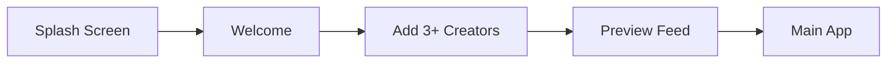

# 🎯 CurateScroll - Your Curated Content Feed

> **Mission**: End doom scrolling. No algorithms. No suggestions. Just the creators *you* choose.

## 🚀 Quick Start

```bash
# Initialize project
npx create-expo-app@latest curate-scroll --template blank-typescript
cd curate-scroll

# Install dependencies
npx expo install react-native-paper react-navigation zustand axios
npx expo install react-native-video @react-navigation/native @react-navigation/bottom-tabs
npx expo install firebase @react-native-async-storage/async-storage
npx expo install react-native-draggable-flatlist expo-haptics
```

## 📋 Table of Contents

- [Vision & Core Features](#vision--core-features)
- [Quick Implementation Roadmap](#quick-implementation-roadmap)
- [Tech Stack & Architecture](#tech-stack--architecture)
- [Project Structure](#project-structure)
- [User Flows](#user-flows)
- [Data Layer](#data-layer)
- [API Integration](#api-integration)
- [UI/UX Design System](#uiux-design-system)
- [Anti-Doom Scrolling Features](#anti-doom-scrolling-features)
- [Deployment](#deployment)
- [Future Features](#future-features)

---

## 🎨 Vision & Core Features

**CurateScroll** is a React Native + Expo mobile app that creates a **unified, distraction-free content feed** from your favorite YouTube channels and Instagram creators.

### Core Features
- ✅ Subscribe to YouTube channels & Instagram accounts
- ✅ Unified chronological feed (videos, shorts, reels, photos)
- ✅ No algorithm, no recommendations
- ✅ Offline caching with AsyncStorage
- ✅ Anti-doom scrolling tools (timers, stats, nudges)
- ✅ Dark mode & customization
- ✅ Cross-platform (iOS & Android)


---

## ⚡ Quick Implementation Roadmap

### Phase 1: Foundation (Week 1)
- [ ] Set up Expo project with TypeScript
- [ ] Configure Firebase (Firestore + Auth)
- [ ] Create basic navigation structure
- [ ] Set up Zustand stores (subscriptions, feed, settings)
- [ ] Define TypeScript types/interfaces

### Phase 2: Data Layer (Week 2)
- [ ] Implement YouTube API service
- [ ] Implement Instagram scraping service
- [ ] Set up caching strategy (Firebase + AsyncStorage)
- [ ] Build content aggregation logic
- [ ] Add error handling & rate limiting

### Phase 3: Core UI (Week 3)
- [ ] Build onboarding flow
- [ ] Create main feed with infinite scroll
- [ ] Implement video/photo player components
- [ ] Add subscription management screen
- [ ] Build settings screen

### Phase 4: Polish (Week 4)
- [ ] Add anti-doom scrolling features
- [ ] Implement dark mode
- [ ] Add animations & haptic feedback
- [ ] Testing & bug fixes
- [ ] Prepare for deployment

---

## 🛠 Tech Stack & Architecture

### Frontend
```typescript
{
  "platform": "React Native + Expo SDK 51+",
  "language": "TypeScript",
  "navigation": "React Navigation v6",
  "stateManagement": "Zustand",
  "ui": "React Native Paper + Custom Components",
  "video": "react-native-video",
  "storage": "AsyncStorage"
}
```

### Backend & Services
```typescript
{
  "database": "Firebase Firestore (Free Tier)",
  "authentication": "Firebase Auth (Optional)",
  "apis": [
    "YouTube Data API v3",
    "Instagram Public Web API"
  ],
  "caching": "Firestore + AsyncStorage",
  "analytics": "Firebase Analytics (Optional)"
}
```

### API Quota Management
| Service | Free Quota | Strategy |
|---------|-----------|----------|
| YouTube API | 10,000 units/day | Cache 1hr, max 20 channels/user |
| Instagram | Unofficial (rate-limited) | 2-5s delays, User-Agent rotation |
| Firebase | 50K reads/day | Global cache per creator |

---

## 📁 Project Structure

```
curate-scroll/
├── app.json                    # Expo config
├── App.tsx                     # Entry point
├── src/
│   ├── types/
│   │   └── index.ts           # All TypeScript interfaces
│   │
│   ├── config/
│   │   ├── firebase.ts        # Firebase initialization
│   │   ├── theme.ts           # Design tokens & colors
│   │   └── constants.ts       # App constants
│   │
│   ├── stores/
│   │   ├── subscriptionStore.ts  # Zustand: User subscriptions
│   │   ├── feedStore.ts          # Zustand: Aggregated feed
│   │   └── settingsStore.ts      # Zustand: App settings
│   │
│   ├── services/
│   │   ├── youtube.service.ts    # YouTube API logic
│   │   ├── instagram.service.ts  # Instagram scraping
│   │   ├── cache.service.ts      # Caching strategy
│   │   └── aggregator.service.ts # Merge & sort content
│   │
│   ├── components/
│   │   ├── common/
│   │   │   ├── Button.tsx
│   │   │   ├── Card.tsx
│   │   │   └── LoadingSpinner.tsx
│   │   ├── feed/
│   │   │   ├── FeedCard.tsx      # Universal content card
│   │   │   ├── VideoPlayer.tsx   # Inline video player
│   │   │   └── ImageViewer.tsx   # Photo display
│   │   ├── subscription/
│   │   │   ├── SubscriptionItem.tsx
│   │   │   ├── SearchModal.tsx
│   │   │   └── SourceBadge.tsx
│   │   └── wellbeing/
│   │       ├── SessionTimer.tsx
│   │       └── StatsCard.tsx
│   │
│   ├── screens/
│   │   ├── Onboarding/
│   │   │   ├── WelcomeScreen.tsx
│   │   │   ├── AddCreatorsScreen.tsx
│   │   │   └── PreviewScreen.tsx
│   │   ├── FeedScreen.tsx
│   │   ├── SubscriptionsScreen.tsx
│   │   ├── SettingsScreen.tsx
│   │   └── StatsScreen.tsx
│   │
│   ├── navigation/
│   │   └── AppNavigator.tsx      # Navigation setup
│   │
│   └── utils/
│       ├── formatDate.ts
│       ├── validateUrl.ts
│       └── delay.ts
│
├── assets/
│   ├── icons/
│   └── splash.png
│
└── .env                         # API keys (gitignored)
```

---

## 👤 User Flows


### 1. Onboarding Flow



**Screens:**
1. **Splash** → Animated logo + tagline: _"Curate Your Scroll"_
2. **Welcome** → Value proposition (3 slides, swipeable)
3. **Add Creators** → Search modal with validation (min 3 sources)
4. **Preview** → Show sample feed from added creators
5. **Done** → Navigate to main feed

**Validation Rules:**
- Minimum 3 subscriptions required
- Must have at least 1 from each platform (optional)
- Auto-detect @username (Instagram) vs channel name (YouTube)

### 2. Main Feed Experience

**Features:**
- 📱 Infinite scroll using `FlatList` with `onEndReached`
- 🔄 Pull-to-refresh (fetch new content)
- 🎬 Auto-play videos (toggleable in settings)
- 📊 Content types:
  - **YouTube Shorts**: Inline auto-play
  - **YouTube Videos**: Tap → Open modal player
  - **Instagram Reels**: Inline player
  - **Instagram Photos**: Tap → Full-screen viewer

**Feed Logic:**
```typescript
// Pseudo-code for feed aggregation
const feed = [
  ...youtubeContent,
  ...instagramContent
]
  .sort((a, b) => new Date(b.publishedAt) - new Date(a.publishedAt))
  .slice(0, 50); // Load first 50
```

**End of Feed UI:**
```
┌─────────────────────┐
│  You're all caught  │
│        up! 🎉       │
│                     │
│  [Add More Creators]│
│  [Take a Break]     │
└─────────────────────┘
```

### 3. Subscription Management

**Actions:**
- ➕ Add: Search modal (debounced, platform auto-detect)
- ➖ Remove: Swipe left → Delete confirmation
- 🔄 Reorder: Drag-and-drop (visual priority)
- 👁 Preview: Tap → View latest posts

**Layout:**
```
┌─────────────────────────┐
│ [Search Bar]            │
├─────────────────────────┤
│ 📺 MrBeast              │
│ 🎬 Marques Brownlee     │
│ 📸 @cristiano           │
│ 📸 @natgeo              │
└─────────────────────────┘
```

---

## 🔍 Search & Add Functionality

### User Perspective

#### How to Add Creators

**Step 1: Open Search Modal**
- From Feed Screen: Tap ➕ button (floating action button)
- From Subscriptions Screen: Tap "Add Creator" button or search bar
- From Onboarding: Search is the main screen

**Step 2: Enter Search Query**
```
┌─────────────────────────────────┐
│  🔍  Search for creators...     │
├─────────────────────────────────┤
│  Recent Searches:               │
│  • MrBeast                      │
│  • @natgeo                      │
└─────────────────────────────────┘
```

**Step 3: Platform Detection**
The app automatically detects the platform:
- **Instagram**: Starts with `@` → `@cristiano`
- **YouTube**: Everything else → `MrBeast`, `MKBHD`, `PewDiePie`
- **Manual**: Toggle platform switch if auto-detect fails

**Step 4: View Search Results**
```
┌─────────────────────────────────┐
│ 📺 MrBeast                      │
│    MrBeast • 245M subscribers   │
│    [Add] [Preview]              │
├─────────────────────────────────┤
│ 📺 MrBeast Gaming               │
│    MrBeast Gaming • 42M subs    │
│    [Add] [Preview]              │
└─────────────────────────────────┘
```

**Step 5: Preview (Optional)**
- Tap "Preview" to see latest 5 posts
- Helps confirm you have the right creator
- Shows content style and post frequency

**Step 6: Add to Subscriptions**
- Tap "Add" button
- Confirmation toast: "✓ MrBeast added!"
- Creator appears in your feed immediately

#### Smart Features

**Auto-Complete Suggestions**
- Type "mr" → Shows "MrBeast", "Mark Rober", "Marques Brownlee"
- Recent searches appear first
- Popular creators suggested

**Duplicate Prevention**
- Already subscribed? Shows "✓ Already Added" button (disabled)
- Prevents accidental duplicate subscriptions

**Error Handling**
- Creator not found: "No results for 'xyz'. Try another name."
- Private Instagram: "This account is private and can't be added."
- API error: "Connection error. Try again later."

**Search History**
- Last 10 searches saved locally
- Clear all with one tap
- Quick re-search from history

---

### Developer Perspective

#### Search Flow Architecture

```typescript
// Search flow diagram
User Input → Debounce (500ms) → Detect Platform → API Call → Parse Results → Display
```

#### Implementation Details

**1. Search Modal Component**

```typescript
// src/components/subscription/SearchModal.tsx
import React, { useState, useEffect } from 'react';
import { Modal, TextInput, FlatList, View, Text } from 'react-native';
import { useDebounce } from '../../hooks/useDebounce';
import { searchCreators } from '../../services/search.service';

interface SearchResult {
  id: string;
  name: string;
  displayName: string;
  platform: 'youtube' | 'instagram';
  thumbnail: string;
  subscriberCount?: string;
  isAlreadyAdded: boolean;
}

export const SearchModal: React.FC<Props> = ({ visible, onClose, onAdd }) => {
  const [query, setQuery] = useState('');
  const [platform, setPlatform] = useState<'auto' | 'youtube' | 'instagram'>('auto');
  const [results, setResults] = useState<SearchResult[]>([]);
  const [loading, setLoading] = useState(false);
  const debouncedQuery = useDebounce(query, 500); // Wait 500ms after typing

  useEffect(() => {
    if (debouncedQuery.length > 0) {
      performSearch(debouncedQuery);
    } else {
      setResults([]);
    }
  }, [debouncedQuery, platform]);

  const performSearch = async (searchQuery: string) => {
    setLoading(true);
    try {
      // Auto-detect platform
      const detectedPlatform = detectPlatform(searchQuery, platform);
      
      const searchResults = await searchCreators(searchQuery, detectedPlatform);
      
      // Check which creators are already added
      const resultsWithStatus = await checkSubscriptionStatus(searchResults);
      
      setResults(resultsWithStatus);
    } catch (error) {
      console.error('Search error:', error);
      showToast('Search failed. Please try again.');
    } finally {
      setLoading(false);
    }
  };

  const detectPlatform = (query: string, userPlatform: string) => {
    if (userPlatform !== 'auto') return userPlatform;
    
    // Auto-detect logic
    if (query.startsWith('@')) return 'instagram';
    if (query.includes('youtube.com') || query.includes('UC')) return 'youtube';
    
    // Default to YouTube for ambiguous queries
    return 'youtube';
  };

  return (
    <Modal visible={visible} animationType="slide">
      <View style={styles.container}>
        {/* Search Input */}
        <TextInput
          placeholder="Search for creators..."
          value={query}
          onChangeText={setQuery}
          autoFocus
          style={styles.input}
        />

        {/* Platform Toggle */}
        <View style={styles.platformToggle}>
          <Toggle
            options={['Auto', 'YouTube', 'Instagram']}
            selected={platform}
            onChange={setPlatform}
          />
        </View>

        {/* Loading Indicator */}
        {loading && <LoadingSpinner />}

        {/* Search Results */}
        <FlatList
          data={results}
          keyExtractor={(item) => item.id}
          renderItem={({ item }) => (
            <SearchResultItem
              result={item}
              onAdd={() => handleAdd(item)}
              onPreview={() => handlePreview(item)}
            />
          )}
          ListEmptyComponent={
            query.length > 0 ? (
              <EmptyState message="No creators found" />
            ) : (
              <RecentSearches onSelect={setQuery} />
            )
          }
        />
      </View>
    </Modal>
  );
};
```

**2. Search Service**

```typescript
// src/services/search.service.ts
import youtubeService from './youtube.service';
import instagramService from './instagram.service';
import { useSubscriptionStore } from '../stores/subscriptionStore';

export interface SearchResult {
  id: string;
  name: string;
  displayName: string;
  platform: 'youtube' | 'instagram';
  thumbnail: string;
  subscriberCount?: string;
  description?: string;
}

class SearchService {
  /**
   * Search for creators across platforms
   */
  async searchCreators(
    query: string,
    platform: 'youtube' | 'instagram'
  ): Promise<SearchResult[]> {
    try {
      if (platform === 'youtube') {
        return await this.searchYouTube(query);
      } else {
        return await this.searchInstagram(query);
      }
    } catch (error) {
      console.error(`Search error (${platform}):`, error);
      throw error;
    }
  }

  /**
   * Search YouTube channels
   */
  private async searchYouTube(query: string): Promise<SearchResult[]> {
    const response = await youtubeService.searchChannels(query, 10); // Max 10 results
    
    return response.map(channel => ({
      id: channel.id,
      name: channel.name,
      displayName: channel.name,
      platform: 'youtube' as const,
      thumbnail: channel.thumbnail,
      subscriberCount: this.formatSubscriberCount(channel.subscriberCount),
      description: channel.description,
    }));
  }

  /**
   * Search Instagram users
   */
  private async searchInstagram(username: string): Promise<SearchResult[]> {
    // Remove @ if present
    const cleanUsername = username.replace('@', '');
    
    try {
      const user = await instagramService.searchUser(cleanUsername);
      
      return [{
        id: user.username,
        name: user.username,
        displayName: `@${user.username}`,
        platform: 'instagram' as const,
        thumbnail: user.profilePicUrl,
        subscriberCount: this.formatSubscriberCount(user.followerCount),
        description: user.biography,
      }];
    } catch (error) {
      // User not found or private
      return [];
    }
  }

  /**
   * Check if creators are already subscribed
   */
  async checkSubscriptionStatus(results: SearchResult[]): Promise<SearchResult[]> {
    const subscriptions = useSubscriptionStore.getState().subscriptions;
    const subscribedIds = new Set(subscriptions.map(sub => sub.id));
    
    return results.map(result => ({
      ...result,
      isAlreadyAdded: subscribedIds.has(result.id),
    }));
  }

  /**
   * Format subscriber count (245M, 42K, etc.)
   */
  private formatSubscriberCount(count: number): string {
    if (count >= 1000000) {
      return `${(count / 1000000).toFixed(1)}M subscribers`;
    } else if (count >= 1000) {
      return `${(count / 1000).toFixed(1)}K subscribers`;
    } else {
      return `${count} subscribers`;
    }
  }

  /**
   * Save search to history
   */
  saveSearchHistory(query: string) {
    const history = this.getSearchHistory();
    const updated = [query, ...history.filter(q => q !== query)].slice(0, 10);
    AsyncStorage.setItem('searchHistory', JSON.stringify(updated));
  }

  /**
   * Get recent searches
   */
  getSearchHistory(): string[] {
    const history = AsyncStorage.getItem('searchHistory');
    return history ? JSON.parse(history) : [];
  }
}

export default new SearchService();
```

**3. YouTube Search Extension**

```typescript
// Extend youtube.service.ts with search functionality

export class YouTubeService {
  // ... existing code ...

  /**
   * Search for channels (multiple results)
   */
  async searchChannels(query: string, maxResults = 10): Promise<ChannelSearchResult[]> {
    try {
      const response = await axios.get(`${BASE_URL}/search`, {
        params: {
          part: 'snippet',
          q: query,
          type: 'channel',
          maxResults,
          key: API_KEY,
        }
      });

      // Get detailed stats for each channel
      const channelIds = response.data.items.map((item: any) => item.id.channelId);
      const detailedChannels = await this.getChannelDetails(channelIds);

      return detailedChannels;
    } catch (error) {
      console.error('YouTube search error:', error);
      throw new Error('Failed to search YouTube channels');
    }
  }

  /**
   * Get detailed channel information (including subscriber count)
   */
  private async getChannelDetails(channelIds: string[]): Promise<ChannelSearchResult[]> {
    const response = await axios.get(`${BASE_URL}/channels`, {
      params: {
        part: 'snippet,statistics',
        id: channelIds.join(','),
        key: API_KEY,
      }
    });

    return response.data.items.map((item: any) => ({
      id: item.id,
      name: item.snippet.title,
      thumbnail: item.snippet.thumbnails.default.url,
      description: item.snippet.description,
      subscriberCount: parseInt(item.statistics.subscriberCount),
      videoCount: parseInt(item.statistics.videoCount),
    }));
  }
}
```

**4. Instagram Search Extension**

```typescript
// Extend instagram.service.ts with search functionality

export class InstagramService {
  // ... existing code ...

  /**
   * Search for a specific Instagram user
   */
  async searchUser(username: string): Promise<InstagramUserResult> {
    await this.delay(2000); // Rate limiting

    try {
      const response = await axios.get(
        `https://www.instagram.com/api/v1/users/web_profile_info/?username=${username}`,
        { headers: INSTAGRAM_HEADERS }
      );

      const user = response.data.data.user;
      
      if (!user) {
        throw new Error('User not found');
      }

      if (user.is_private && !user.followed_by_viewer) {
        throw new Error('User is private');
      }

      return {
        username: user.username,
        fullName: user.full_name,
        profilePicUrl: user.profile_pic_url,
        biography: user.biography,
        followerCount: user.edge_followed_by.count,
        followingCount: user.edge_follow.count,
        postCount: user.edge_owner_to_timeline_media.count,
        isPrivate: user.is_private,
        isVerified: user.is_verified,
      };
    } catch (error: any) {
      if (error.response?.status === 404) {
        throw new Error('User not found');
      }
      throw error;
    }
  }
}
```

**5. Custom Debounce Hook**

```typescript
// src/hooks/useDebounce.ts
import { useState, useEffect } from 'react';

export function useDebounce<T>(value: T, delay: number): T {
  const [debouncedValue, setDebouncedValue] = useState<T>(value);

  useEffect(() => {
    // Set up the timeout
    const handler = setTimeout(() => {
      setDebouncedValue(value);
    }, delay);

    // Clean up timeout if value changes before delay completes
    return () => {
      clearTimeout(handler);
    };
  }, [value, delay]);

  return debouncedValue;
}
```

**6. Add to Subscription Store**

```typescript
// src/stores/subscriptionStore.ts
import { create } from 'zustand';
import { persist } from 'zustand/middleware';

interface SubscriptionStore {
  subscriptions: Subscription[];
  addSubscription: (creator: SearchResult) => Promise<void>;
  removeSubscription: (id: string) => void;
  isSubscribed: (id: string) => boolean;
}

export const useSubscriptionStore = create<SubscriptionStore>()(
  persist(
    (set, get) => ({
      subscriptions: [],

      addSubscription: async (creator) => {
        // Check for duplicates
        if (get().isSubscribed(creator.id)) {
          throw new Error('Already subscribed to this creator');
        }

        const newSub: Subscription = {
          id: creator.id,
          type: creator.platform,
          name: creator.name,
          displayName: creator.displayName,
          avatarUrl: creator.thumbnail,
          addedAt: new Date(),
        };

        set((state) => ({
          subscriptions: [...state.subscriptions, newSub],
        }));

        // Trigger feed refresh
        useFeedStore.getState().refreshFeed();
      },

      removeSubscription: (id) => {
        set((state) => ({
          subscriptions: state.subscriptions.filter(sub => sub.id !== id),
        }));
      },

      isSubscribed: (id) => {
        return get().subscriptions.some(sub => sub.id === id);
      },
    }),
    {
      name: 'subscriptions-storage',
    }
  )
);
```

#### Search Optimization Strategies

**Performance**
- Debounce input (500ms) to reduce API calls
- Cache search results for 5 minutes
- Limit results to 10 per query
- Cancel pending requests on new input

**UX Enhancements**
- Show loading skeleton while searching
- Highlight matching text in results
- Sort by relevance (subscriber count)
- Recent searches persist locally

**Error Handling**
```typescript
try {
  const results = await searchCreators(query, platform);
} catch (error) {
  if (error.message === 'Rate limited') {
    showToast('Too many searches. Wait 30 seconds.');
  } else if (error.message === 'Network error') {
    showToast('Connection error. Check your internet.');
  } else {
    showToast('Search failed. Try again.');
  }
}
```

**API Quota Management**
- YouTube search: 100 units per query (use sparingly)
- Cache results across all users (Firestore)
- Implement search result sharing (if user A searches "MrBeast", user B sees cached results)

---

### 4. Settings & Customization

**Options:**
- ⚙️ **Playback**
  - Auto-play videos (on/off)
  - Video quality (auto/720p/1080p)
- 🎨 **Appearance**
  - Theme: Light / Dark / System
  - Content density (compact/comfortable)
- 📊 **Feed Preferences**
  - Sort: Chronological / By Source
  - Show: All / Videos Only / Photos Only
- ⏱ **Wellbeing**
  - Session timer (15/30/45/60 min)
  - Break reminders (on/off)
  - Weekly usage stats

---

## 📊 Data Layer

### TypeScript Interfaces

```typescript
// src/types/index.ts

export type PlatformType = 'youtube' | 'instagram';
export type ContentType = 'video' | 'short' | 'reel' | 'photo';

export interface Subscription {
  id: string;
  type: PlatformType;
  name: string;
  displayName: string;
  avatarUrl?: string;
  addedAt: Date;
}

export interface ContentItem {
  id: string;
  sourceId: string;        // Channel/User ID
  sourceName: string;
  type: ContentType;
  platform: PlatformType;
  title: string;
  description?: string;
  thumbnail: string;
  url: string;
  publishedAt: Date;
  duration?: number;       // For videos (seconds)
  viewCount?: number;
  likeCount?: number;
}

export interface FeedState {
  items: ContentItem[];
  isLoading: boolean;
  error: string | null;
  lastUpdated: Date | null;
  hasMore: boolean;
}

export interface UserSettings {
  autoPlay: boolean;
  theme: 'light' | 'dark' | 'system';
  sortBy: 'chronological' | 'source';
  sessionTimer: number;    // Minutes
  breakReminders: boolean;
}
```

### Firebase Schema

```typescript
// Firestore Collections

// 1. users/{userId}
{
  subscriptions: [
    {
      id: "UC-lHJZR3Gqxm24_Vd_AJ5Yw",  // Channel/User ID
      type: "youtube",
      name: "PewDiePie",
      displayName: "PewDiePie",
      avatarUrl: "https://...",
      addedAt: "2024-11-01T12:00:00Z"
    },
    {
      id: "cristiano",
      type: "instagram",
      name: "cristiano",
      displayName: "@cristiano",
      avatarUrl: "https://...",
      addedAt: "2024-11-02T15:30:00Z"
    }
  ],
  settings: {
    autoPlay: true,
    theme: "system",
    sortBy: "chronological",
    sessionTimer: 30,
    breakReminders: true
  },
  stats: {
    totalScrollTime: 1200,        // Seconds
    sessionsThisWeek: 12,
    contentWatched: 45
  }
}

// 2. contentCache/{platformType}_{sourceId}
{
  sourceId: "UC-lHJZR3Gqxm24_Vd_AJ5Yw",
  platform: "youtube",
  lastFetched: "2024-11-06T10:30:00Z",
  items: [ContentItem],           // Array of content
  ttl: 3600                        // Cache lifetime (seconds)
}
```

### Caching Strategy

**Three-Tier Cache:**
1. **Memory** → Zustand store (session-only)
2. **Local** → AsyncStorage (offline access)
3. **Cloud** → Firestore (shared across users)

**Flow:**
```typescript
async function getContent(sourceId: string) {
  // Check memory
  const memory = feedStore.getState().items;
  if (memory.length > 0) return memory;
  
  // Check local storage
  const local = await AsyncStorage.getItem(`cache_${sourceId}`);
  if (local) {
    const cached = JSON.parse(local);
    if (Date.now() - cached.timestamp < 3600000) { // 1 hour
      return cached.items;
    }
  }
  
  // Check Firestore
  const firestoreDoc = await getDoc(doc(db, 'contentCache', `${platform}_${sourceId}`));
  if (firestoreDoc.exists()) {
    const data = firestoreDoc.data();
    if (Date.now() - data.lastFetched < 3600000) {
      return data.items;
    }
  }
  
  // Fetch from API
  const fresh = await fetchFromAPI(sourceId);
  
  // Update all caches
  await updateCaches(sourceId, fresh);
  return fresh;
}
```

---

## 🔌 API Integration

### YouTube Data API v3

**Setup:**
1. Get API key from [Google Cloud Console](https://console.cloud.google.com/)
2. Enable YouTube Data API v3
3. Add to `.env`: `YOUTUBE_API_KEY=your_key_here`

**Implementation:**
```typescript
// src/services/youtube.service.ts
import axios from 'axios';
import { ContentItem, PlatformType } from '../types';

const API_KEY = process.env.EXPO_PUBLIC_YOUTUBE_API_KEY;
const BASE_URL = 'https://www.googleapis.com/youtube/v3';

export class YouTubeService {
  /**
   * Search for a channel by name
   */
  async searchChannel(query: string): Promise<{ id: string; name: string; thumbnail: string }> {
    const response = await axios.get(`${BASE_URL}/search`, {
      params: {
        part: 'snippet',
        q: query,
        type: 'channel',
        maxResults: 1,
        key: API_KEY
      }
    });

    const channel = response.data.items[0];
    if (!channel) throw new Error('Channel not found');

    return {
      id: channel.id.channelId,
      name: channel.snippet.title,
      thumbnail: channel.snippet.thumbnails.default.url
    };
  }

  /**
   * Fetch latest videos from a channel
   */
  async fetchChannelVideos(channelId: string, maxResults = 20): Promise<ContentItem[]> {
    try {
      const response = await axios.get(`${BASE_URL}/search`, {
        params: {
          part: 'snippet',
          channelId,
          maxResults,
          order: 'date',
          type: 'video',
          key: API_KEY
        }
      });

      return response.data.items.map((item: any) => this.mapToContentItem(item));
    } catch (error) {
      console.error('YouTube API Error:', error);
      throw new Error('Failed to fetch YouTube content');
    }
  }

  /**
   * Map YouTube API response to ContentItem
   */
  private mapToContentItem(item: any): ContentItem {
    const isShort = item.snippet.title.toLowerCase().includes('#shorts');
    
    return {
      id: item.id.videoId,
      sourceId: item.snippet.channelId,
      sourceName: item.snippet.channelTitle,
      type: isShort ? 'short' : 'video',
      platform: 'youtube',
      title: item.snippet.title,
      description: item.snippet.description,
      thumbnail: item.snippet.thumbnails.medium.url,
      url: `https://www.youtube.com/watch?v=${item.id.videoId}`,
      publishedAt: new Date(item.snippet.publishedAt),
    };
  }
}

export default new YouTubeService();
```

**Rate Limiting:**
- YouTube quota: 10,000 units/day
- Each search = 100 units, each video list = 1 unit
- **Strategy**: Cache aggressively, limit to 20 channels per user

---

### Instagram Public Web API

⚠️ **Important**: Instagram doesn't have an official public API. This uses web scraping, which is fragile and may break.

**Implementation:**
```typescript
// src/services/instagram.service.ts
import axios from 'axios';
import { ContentItem } from '../types';

const INSTAGRAM_HEADERS = {
  'User-Agent': 'Mozilla/5.0 (Macintosh; Intel Mac OS X 10_15_7) AppleWebKit/537.36',
  'X-IG-App-ID': '936619743392459',
  'Referer': 'https://www.instagram.com/',
  'Accept': 'application/json',
};

export class InstagramService {
  /**
   * Fetch user profile and posts (public accounts only)
   */
  async fetchUserPosts(username: string): Promise<ContentItem[]> {
    try {
      // Add delay to avoid rate limiting
      await this.delay(2000 + Math.random() * 3000);

      const response = await axios.get(
        `https://www.instagram.com/api/v1/users/web_profile_info/?username=${username}`,
        { headers: INSTAGRAM_HEADERS }
      );

      const user = response.data.data.user;
      if (!user) throw new Error('User not found or private');

      const edges = user.edge_owner_to_timeline_media.edges;
      return edges.map((edge: any) => this.mapToContentItem(edge.node, username));
    } catch (error: any) {
      if (error.response?.status === 429) {
        throw new Error('Rate limited. Please try again later.');
      }
      console.error('Instagram API Error:', error);
      throw new Error('Failed to fetch Instagram content');
    }
  }

  /**
   * Map Instagram post to ContentItem
   */
  private mapToContentItem(node: any, username: string): ContentItem {
    const isVideo = node.is_video;
    const isReel = node.product_type === 'clips';

    return {
      id: node.id,
      sourceId: username,
      sourceName: `@${username}`,
      type: isReel ? 'reel' : isVideo ? 'video' : 'photo',
      platform: 'instagram',
      title: node.edge_media_to_caption.edges[0]?.node.text || '',
      thumbnail: node.thumbnail_src || node.display_url,
      url: node.video_url || node.display_url,
      publishedAt: new Date(node.taken_at_timestamp * 1000),
      likeCount: node.edge_liked_by?.count,
    };
  }

  /**
   * Utility: Add delay between requests
   */
  private delay(ms: number): Promise<void> {
    return new Promise(resolve => setTimeout(resolve, ms));
  }
}

export default new InstagramService();
```

**Safety Measures:**
| Risk | Mitigation |
|------|------------|
| Rate limits | 2-5s random delay between requests |
| IP bans | Rotate User-Agent, consider proxy for production |
| API changes | Wrap in try-catch, fallback to cached data |
| Private accounts | Show error: "This account is private" |
| TOS violation | Public data only, no scraping for commercial use at scale |

---

### Content Aggregation Service

```typescript
// src/services/aggregator.service.ts
import { ContentItem } from '../types';
import youtubeService from './youtube.service';
import instagramService from './instagram.service';
import cacheService from './cache.service';

export class AggregatorService {
  /**
   * Fetch and merge content from all subscriptions
   */
  async aggregateContent(subscriptions: Subscription[]): Promise<ContentItem[]> {
    const allContent: ContentItem[] = [];

    for (const sub of subscriptions) {
      try {
        // Check cache first
        const cached = await cacheService.get(sub.id, sub.type);
        if (cached) {
          allContent.push(...cached);
          continue;
        }

        // Fetch fresh data
        const content = sub.type === 'youtube'
          ? await youtubeService.fetchChannelVideos(sub.id)
          : await instagramService.fetchUserPosts(sub.id);

        // Update cache
        await cacheService.set(sub.id, sub.type, content);
        allContent.push(...content);
      } catch (error) {
        console.error(`Failed to fetch content for ${sub.name}:`, error);
        // Continue with other subscriptions
      }
    }

    // Sort by date (newest first)
    return allContent.sort(
      (a, b) => b.publishedAt.getTime() - a.publishedAt.getTime()
    );
  }
}

export default new AggregatorService();
```

---

## 🎨 UI/UX Design System

### Design Tokens

```typescript
// src/config/theme.ts

export const colors = {
  // Brand
  primary: '#4A90E2',
  primaryDark: '#357ABD',
  accent: '#7ED321',
  
  // Platform colors
  youtube: '#FF0000',
  instagram: '#E1306C',
  
  // Light theme
  light: {
    background: '#F5F5F5',
    surface: '#FFFFFF',
    text: '#333333',
    textSecondary: '#666666',
    border: '#E0E0E0',
  },
  
  // Dark theme
  dark: {
    background: '#121212',
    surface: '#1E1E1E',
    text: '#EEEEEE',
    textSecondary: '#AAAAAA',
    border: '#333333',
  },
  
  // Semantic
  success: '#7ED321',
  warning: '#FF9500',
  error: '#FF3B30',
  info: '#5AC8FA',
};

export const spacing = {
  xs: 4,
  sm: 8,
  md: 16,
  lg: 24,
  xl: 32,
};

export const typography = {
  h1: { fontSize: 32, fontWeight: 'bold' },
  h2: { fontSize: 24, fontWeight: 'bold' },
  h3: { fontSize: 20, fontWeight: '600' },
  body: { fontSize: 16, fontWeight: 'normal' },
  caption: { fontSize: 14, fontWeight: 'normal' },
  small: { fontSize: 12, fontWeight: 'normal' },
};

export const borderRadius = {
  sm: 4,
  md: 8,
  lg: 12,
  xl: 16,
  full: 9999,
};
```

### Component Examples

#### FeedCard Component
```typescript
// src/components/feed/FeedCard.tsx
import React from 'react';
import { View, Text, Image, StyleSheet, Pressable } from 'react-native';
import { ContentItem } from '../../types';
import SourceBadge from '../subscription/SourceBadge';

interface Props {
  item: ContentItem;
  onPress: () => void;
}

export const FeedCard: React.FC<Props> = ({ item, onPress }) => {
  return (
    <Pressable style={styles.card} onPress={onPress}>
      <Image source={{ uri: item.thumbnail }} style={styles.thumbnail} />
      
      <View style={styles.content}>
        <Text style={styles.title} numberOfLines={2}>
          {item.title}
        </Text>
        
        <View style={styles.meta}>
          <SourceBadge platform={item.platform} />
          <Text style={styles.creator}>{item.sourceName}</Text>
          <Text style={styles.date}>
            {formatTimeAgo(item.publishedAt)}
          </Text>
        </View>
      </View>
    </Pressable>
  );
};

const styles = StyleSheet.create({
  card: {
    backgroundColor: '#FFFFFF',
    borderRadius: 12,
    marginHorizontal: 16,
    marginVertical: 8,
    elevation: 2,
    shadowColor: '#000',
    shadowOffset: { width: 0, height: 2 },
    shadowOpacity: 0.1,
    shadowRadius: 4,
  },
  thumbnail: {
    width: '100%',
    height: 200,
    borderTopLeftRadius: 12,
    borderTopRightRadius: 12,
  },
  content: {
    padding: 12,
  },
  title: {
    fontSize: 16,
    fontWeight: '600',
    marginBottom: 8,
  },
  meta: {
    flexDirection: 'row',
    alignItems: 'center',
    gap: 8,
  },
  creator: {
    fontSize: 14,
    color: '#666',
  },
  date: {
    fontSize: 12,
    color: '#999',
    marginLeft: 'auto',
  },
});
```

#### SourceBadge Component
```typescript
// src/components/subscription/SourceBadge.tsx
import React from 'react';
import { View, Text, StyleSheet } from 'react-native';
import { PlatformType } from '../../types';

interface Props {
  platform: PlatformType;
}

export const SourceBadge: React.FC<Props> = ({ platform }) => {
  const isYouTube = platform === 'youtube';
  
  return (
    <View style={[styles.badge, isYouTube ? styles.youtube : styles.instagram]}>
      <Text style={styles.text}>
        {isYouTube ? '▶' : '📸'}
      </Text>
    </View>
  );
};

const styles = StyleSheet.create({
  badge: {
    paddingHorizontal: 8,
    paddingVertical: 4,
    borderRadius: 4,
  },
  youtube: {
    backgroundColor: '#FF0000',
  },
  instagram: {
    background: 'linear-gradient(45deg, #F58529, #DD2A7B, #8134AF)',
    backgroundColor: '#E1306C', // Fallback
  },
  text: {
    color: '#FFF',
    fontSize: 10,
    fontWeight: 'bold',
  },
});
```

### Screen Layouts

#### Feed Screen
```typescript
// src/screens/FeedScreen.tsx
import React, { useEffect, useState } from 'react';
import { FlatList, RefreshControl, View } from 'react-native';
import { useFeedStore } from '../stores/feedStore';
import { FeedCard } from '../components/feed/FeedCard';

export const FeedScreen: React.FC = () => {
  const { items, isLoading, fetchFeed, refreshFeed } = useFeedStore();
  const [refreshing, setRefreshing] = useState(false);

  useEffect(() => {
    fetchFeed();
  }, []);

  const handleRefresh = async () => {
    setRefreshing(true);
    await refreshFeed();
    setRefreshing(false);
  };

  return (
    <FlatList
      data={items}
      keyExtractor={(item) => item.id}
      renderItem={({ item }) => (
        <FeedCard item={item} onPress={() => {/* Open player */}} />
      )}
      refreshControl={
        <RefreshControl refreshing={refreshing} onRefresh={handleRefresh} />
      }
      onEndReached={fetchFeed}
      onEndReachedThreshold={0.5}
      ListEmptyComponent={<EmptyFeedView />}
    />
  );
};
```

---

## ⏱ Anti-Doom Scrolling Features

### Session Timer

```typescript
// src/components/wellbeing/SessionTimer.tsx
import React, { useEffect, useState } from 'react';
import { Modal, View, Text, Button } from 'react-native';
import * as Haptics from 'expo-haptics';
import { useSettingsStore } from '../../stores/settingsStore';

export const SessionTimer: React.FC = () => {
  const { sessionTimer } = useSettingsStore();
  const [seconds, setSeconds] = useState(0);
  const [showModal, setShowModal] = useState(false);

  useEffect(() => {
    const interval = setInterval(() => {
      setSeconds(s => {
        const newSeconds = s + 1;
        const limitReached = newSeconds >= sessionTimer * 60;
        
        if (limitReached && !showModal) {
          Haptics.notificationAsync(Haptics.NotificationFeedbackType.Warning);
          setShowModal(true);
        }
        
        return newSeconds;
      });
    }, 1000);

    return () => clearInterval(interval);
  }, [sessionTimer]);

  return (
    <Modal visible={showModal} transparent animationType="fade">
      <View style={styles.overlay}>
        <View style={styles.modal}>
          <Text style={styles.title}>Time's Up! ⏰</Text>
          <Text style={styles.message}>
            You've been scrolling for {sessionTimer} minutes.
            Take a break?
          </Text>
          <Button title="5 More Minutes" onPress={() => {
            setSeconds(0);
            setShowModal(false);
          }} />
          <Button title="Close App" onPress={() => {/* Exit */}} />
        </View>
      </View>
    </Modal>
  );
};
```

### Usage Statistics

```typescript
// Track user behavior
interface UsageStats {
  totalScrollTime: number;      // Total seconds
  sessionsThisWeek: number;
  contentWatched: number;
  averageSessionLength: number;
  mostActiveDay: string;
}

// Display weekly summary
export const StatsScreen: React.FC = () => {
  const stats = useStatsStore();
  
  return (
    <View>
      <StatsCard title="Total Time" value={formatTime(stats.totalScrollTime)} />
      <StatsCard title="Sessions" value={stats.sessionsThisWeek} />
      <StatsCard title="Content Watched" value={stats.contentWatched} />
      <Chart data={stats.dailyUsage} />
    </View>
  );
};
```

### Gentle Nudges

```typescript
// After N scrolls, show a reminder
let scrollCount = 0;

const onScroll = () => {
  scrollCount++;
  
  if (scrollCount % 50 === 0) {
    showToast('💡 Time to stretch?');
  }
  
  if (scrollCount % 100 === 0) {
    showToast('🌊 Take a deep breath');
  }
};
```

---

## 🚀 Deployment

### Build Commands

```bash
# Development
npx expo start

# iOS Simulator
npx expo run:ios

# Android Emulator
npx expo run:android

# Production Build (EAS Build)
npm install -g eas-cli
eas login
eas build --platform ios
eas build --platform android

# Submit to App Stores
eas submit --platform ios
eas submit --platform android
```

### Environment Variables

Create `.env` file:
```bash
EXPO_PUBLIC_YOUTUBE_API_KEY=your_youtube_api_key
EXPO_PUBLIC_FIREBASE_API_KEY=your_firebase_api_key
EXPO_PUBLIC_FIREBASE_PROJECT_ID=your_project_id
# Add other Firebase config...
```

### Pre-Launch Checklist

- [ ] Test on both iOS and Android
- [ ] Verify all API endpoints work
- [ ] Check offline mode functionality
- [ ] Test with 20+ subscriptions
- [ ] Ensure proper error handling
- [ ] Add analytics tracking
- [ ] Create app icon and splash screen
- [ ] Write privacy policy
- [ ] Set up crash reporting (Sentry)
- [ ] Configure app store listings

### Monitoring & Maintenance

**Weekly:**
- Monitor Instagram API changes (fragile!)
- Check Firebase quota usage
- Review crash reports

**Monthly:**
- Update dependencies
- Review user feedback
- Optimize cache strategy

**Alerts:**
- Firebase quota > 80%
- YouTube API quota > 80%
- Crash rate > 1%

---

## 🔮 Future Features

### Phase 2 Features
- [ ] **TikTok Integration** (if public API available)
- [ ] **Twitter/X Posts** from followed accounts
- [ ] **Reddit Feeds** from subscribed subreddits
- [ ] **Podcast Episodes** (RSS feeds)

### Phase 3 Features
- [ ] **Collaborative Feeds** (share subscriptions with friends)
- [ ] **Smart Recommendations** (opt-in AI suggestions)
- [ ] **Content Collections** (save posts to folders)
- [ ] **Export Feed** as JSON/CSV
- [ ] **Offline Downloads** for videos
- [ ] **Picture-in-Picture** video playback
- [ ] **Casting** to TV (Chromecast/AirPlay)

### Phase 4 Features
- [ ] **Desktop App** (Electron wrapper)
- [ ] **Browser Extension** (Chrome/Firefox)
- [ ] **API for Developers** (paid tier)
- [ ] **Premium Features**:
  - Unlimited subscriptions
  - Advanced analytics
  - Custom themes
  - Priority support

---

## 💡 Development Tips

### For AI Coding Assistants

```typescript
// ✅ Good: Clear, explicit code
async function fetchContent(id: string): Promise<ContentItem[]> {
  try {
    const response = await api.get(`/content/${id}`);
    return response.data.map(mapToContentItem);
  } catch (error) {
    console.error('Fetch error:', error);
    throw new Error('Failed to fetch content');
  }
}

// ❌ Bad: Vague, implicit
const getData = (x: any) => api.get(x).then(r => r.data);
```

### Debugging Workflow

1. **Log Everything**: Use descriptive console.logs
2. **React Native Debugger**: Chrome DevTools integration
3. **Flipper**: Facebook's debugging platform
4. **expo-dev-client**: Custom development builds

### Testing Strategy

```typescript
// Unit tests (Jest)
describe('YouTubeService', () => {
  it('should fetch channel videos', async () => {
    const videos = await youtubeService.fetchChannelVideos('UC123');
    expect(videos).toHaveLength(20);
    expect(videos[0]).toHaveProperty('id');
  });
});

// Integration tests
describe('Feed Aggregation', () => {
  it('should merge and sort content', async () => {
    const feed = await aggregatorService.aggregateContent(mockSubs);
    expect(feed[0].publishedAt >= feed[1].publishedAt).toBe(true);
  });
});
```

---

## 📚 Key Resources

### Documentation
- [Expo Docs](https://docs.expo.dev/)
- [React Navigation](https://reactnavigation.org/)
- [React Native Paper](https://reactnativepaper.com/)
- [Zustand Guide](https://docs.pmnd.rs/zustand)
- [Firebase Docs](https://firebase.google.com/docs)

### APIs
- [YouTube Data API](https://developers.google.com/youtube/v3)
- [Instagram Web API](https://developers.facebook.com/docs/instagram-api) (official is limited)

### Community
- [Expo Discord](https://chat.expo.dev/)
- [React Native Community](https://reactnative.dev/community/overview)

---

## 🎯 Success Metrics

### User Engagement
- Daily Active Users (DAU)
- Average session time
- Content consumption rate
- Retention (D1, D7, D30)

### Technical Health
- App crash rate < 1%
- API success rate > 99%
- Average load time < 2s
- Cache hit rate > 80%

### Business Goals
- User growth rate
- App store ratings > 4.5★
- Feature adoption
- User feedback sentiment

---

## 📝 Final Notes

### Privacy & Ethics
- **No tracking**: Minimal analytics, respect user privacy
- **Transparency**: Explain what data is stored (Firebase)
- **User control**: Easy data export & account deletion
- **Fair use**: Respect platform TOS, public data only

### Sustainability
- Firebase free tier should handle 1000+ users
- YouTube quota manageable with caching
- Instagram scraping is the biggest risk (monitor closely)
- Consider premium tier for scaling beyond free limits

---

## 🎉 You're Ready to Build!

This document contains everything you need to start building CurateScroll. Key steps:

1. **Set up project**: `npx create-expo-app` + install dependencies
2. **Define types**: Copy TypeScript interfaces
3. **Build services**: YouTube & Instagram fetchers
4. **Create screens**: Start with onboarding
5. **Test incrementally**: One feature at a time
6. **Deploy**: EAS Build when ready

**Remember**: Start small, iterate fast, and focus on the core experience first.

---

**CurateScroll** — *Build Your Feed. Own Your Focus.* 🎯

**Last Updated**: November 6, 2025  
**Version**: 1.0  
**Status**: Ready for Development

---

## 🤖 AI Coding Assistant Prompts

Use these prompts with GitHub Copilot or other LLMs:

### Initial Setup
```
"Create a new Expo TypeScript project with React Navigation, Zustand, and React Native Paper. Set up the folder structure for CurateScroll app."
```

### Services
```
"Implement YouTubeService class with searchChannel and fetchChannelVideos methods using YouTube Data API v3. Include proper TypeScript types and error handling."
```

### Components
```
"Create a FeedCard component that displays a content item with thumbnail, title, source badge, and timestamp. Use React Native Paper styling."
```

### State Management
```
"Set up Zustand store for managing user subscriptions. Include actions: add, remove, reorder subscriptions. Persist to AsyncStorage."
```

### Search & Add Feature
```
"Create a SearchModal component with debounced input, platform detection, and search results list. Integrate with YouTubeService and InstagramService."
```

---

## 📊 Search & Add Feature Flow Diagram

```
┌─────────────────────────────────────────────────────────────────┐
│                     USER INITIATES SEARCH                        │
│              (Taps + button or "Add Creator")                   │
└────────────────────────────┬────────────────────────────────────┘
                             │
                             ▼
┌─────────────────────────────────────────────────────────────────┐
│                    SEARCH MODAL OPENS                            │
│  ┌────────────────────────────────────────────────────────┐    │
│  │  🔍  Type channel name or @username...                 │    │
│  └────────────────────────────────────────────────────────┘    │
│  [Auto] [YouTube] [Instagram]  ← Platform Toggle               │
└────────────────────────────┬────────────────────────────────────┘
                             │
                             ▼
                    User Types Query
                             │
                             ▼
┌─────────────────────────────────────────────────────────────────┐
│                     DEBOUNCE (500ms)                             │
│              Wait for user to stop typing                        │
└────────────────────────────┬────────────────────────────────────┘
                             │
                             ▼
┌─────────────────────────────────────────────────────────────────┐
│                   PLATFORM DETECTION                             │
│  • Starts with "@" → Instagram                                  │
│  • Contains "youtube.com" or "UC" → YouTube                     │
│  • Manual toggle selected → Use that platform                   │
│  • Default → YouTube                                            │
└────────────────────────────┬────────────────────────────────────┘
                             │
                ┌────────────┴────────────┐
                ▼                         ▼
     ┌──────────────────┐      ┌──────────────────┐
     │  YouTube Search  │      │ Instagram Search │
     │  API Call        │      │  API Call        │
     └─────────┬────────┘      └─────────┬────────┘
               │                         │
               ▼                         ▼
     ┌──────────────────┐      ┌──────────────────┐
     │ Get channel info │      │  Get user info   │
     │ + subscriber count│      │ + follower count │
     └─────────┬────────┘      └─────────┬────────┘
               │                         │
               └────────────┬────────────┘
                            ▼
┌─────────────────────────────────────────────────────────────────┐
│              CHECK IF ALREADY SUBSCRIBED                         │
│  Compare result IDs with user's subscriptions                   │
└────────────────────────────┬────────────────────────────────────┘
                             │
                             ▼
┌─────────────────────────────────────────────────────────────────┐
│                    DISPLAY RESULTS                               │
│  ┌──────────────────────────────────────────────────────┐      │
│  │ 📺 MrBeast                              [Add]         │      │
│  │    245M subscribers                     [Preview]     │      │
│  ├──────────────────────────────────────────────────────┤      │
│  │ 📺 MrBeast Gaming                       [Add]         │      │
│  │    42M subscribers                      [Preview]     │      │
│  ├──────────────────────────────────────────────────────┤      │
│  │ 📸 @mrbeast                             ✓ Added       │      │
│  │    52M followers                        [Preview]     │      │
│  └──────────────────────────────────────────────────────┘      │
└────────────────────────────┬────────────────────────────────────┘
                             │
                ┌────────────┴────────────┐
                ▼                         ▼
     ┌──────────────────┐      ┌──────────────────┐
     │  User Taps       │      │  User Taps       │
     │    [ADD]         │      │   [PREVIEW]      │
     └─────────┬────────┘      └─────────┬────────┘
               │                         │
               ▼                         ▼
     ┌──────────────────┐      ┌──────────────────┐
     │ Add to           │      │ Show latest      │
     │ Subscriptions    │      │ 5 posts          │
     │ Store            │      │ (Modal)          │
     └─────────┬────────┘      └──────────────────┘
               │
               ▼
     ┌──────────────────┐
     │ Save to Firebase │
     │ & AsyncStorage   │
     └─────────┬────────┘
               │
               ▼
     ┌──────────────────┐
     │ Trigger Feed     │
     │ Refresh          │
     └─────────┬────────┘
               │
               ▼
     ┌──────────────────┐
     │ Show Toast:      │
     │ "✓ MrBeast added"│
     └─────────┬────────┘
               │
               ▼
     ┌──────────────────┐
     │ Content appears  │
     │ in feed          │
     └──────────────────┘
```

---

## ✅ Search & Add Best Practices

### For Users

**Tips for Better Search Results:**
1. **Be Specific**: Use the creator's exact name or handle
2. **Use @**: For Instagram, always start with `@` (e.g., `@cristiano`)
3. **Check Subscriber Count**: Verify you have the right creator
4. **Preview First**: Tap preview to see their content style
5. **Recent Searches**: Quickly re-add creators from history

**Common Issues:**
- "Creator not found" → Check spelling, try alternate names
- "Private account" → Instagram private accounts can't be added
- "Already added" → This creator is in your subscriptions
- Search slow → Clear app cache or restart app

### For Developers

**Performance Optimization:**
```typescript
// 1. Implement request cancellation
let searchController = new AbortController();

const search = async (query: string) => {
  // Cancel previous request
  searchController.abort();
  searchController = new AbortController();
  
  const results = await fetch(url, {
    signal: searchController.signal
  });
};

// 2. Cache search results
const searchCache = new Map<string, { results: any[], timestamp: number }>();
const CACHE_TTL = 5 * 60 * 1000; // 5 minutes

const getCachedSearch = (query: string) => {
  const cached = searchCache.get(query);
  if (cached && Date.now() - cached.timestamp < CACHE_TTL) {
    return cached.results;
  }
  return null;
};
```

**Search Analytics:**
Track these metrics to improve search:
- Most searched terms
- Search-to-add conversion rate
- Failed searches (help improve auto-complete)
- Platform preference (YouTube vs Instagram)

**Edge Cases to Handle:**
```typescript
// Empty query
if (!query.trim()) {
  return showRecentSearches();
}

// Special characters
const sanitizedQuery = query.replace(/[^\w@\s-]/g, '');

// Very long queries
if (query.length > 100) {
  return showError('Search query too long');
}

// YouTube channel ID direct input
if (query.startsWith('UC') && query.length === 24) {
  return fetchChannelById(query);
}

// Instagram URL pasted
if (query.includes('instagram.com/')) {
  const username = extractUsername(query);
  return searchInstagram(username);
}
```

**Rate Limiting Protection:**
```typescript
// Track API calls per minute
const apiCallTracker = {
  youtube: { calls: 0, resetAt: Date.now() + 60000 },
  instagram: { calls: 0, resetAt: Date.now() + 60000 }
};

const checkRateLimit = (platform: 'youtube' | 'instagram') => {
  const tracker = apiCallTracker[platform];
  
  if (Date.now() > tracker.resetAt) {
    tracker.calls = 0;
    tracker.resetAt = Date.now() + 60000;
  }
  
  const limits = { youtube: 30, instagram: 10 }; // Per minute
  
  if (tracker.calls >= limits[platform]) {
    throw new Error('Rate limit exceeded. Please wait.');
  }
  
  tracker.calls++;
};
```

Good luck building! 🚀